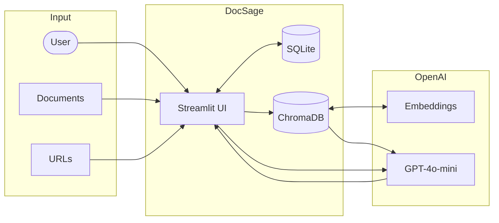

# Streamlit-Naive-RAG-DocSage

DocSage is a lightweight document-aware chat application built with Streamlit, SQLite, and LangChain.
It lets you create multiple chats, upload documents or links as knowledge sources, and ask questions that are answered strictly from the provided context.

The system uses vector embeddings and retrieval to ground answers in your documents.

>> NOTE: This repo is inspired by Ngonidzashe Nzenze's post. To dive deeper, see [his article](https://dev.to/ngonidzashe/doc-sage-create-a-smart-rag-app-with-langchain-and-streamlit-4lin).

## Project Structure

```text
.
|-- data/
|   |-- sqlite/doc_sage.sqlite
|   |-- temp_uploads/
|   `-- vector_store/
|-- scripts/
|   `-- init_database.py
|-- src/
|   |-- database.py
|   |-- paths.py
|   |-- rag_service.py
|   `-- streamlit_app.py
|-- main.py
`-- README.md
```

## Project Overview

At a high level, the project consists of these main parts:

1. Streamlit UI [src/streamlit_app.py](src/streamlit_app.py)  
Handles the web interface, chat flow, document uploads, and link ingestion.

2. Database initialization [scripts/init_database.py](scripts/init_database.py)  
Initializes the SQLite database under `data/sqlite/`.

3. Database access layer [src/database.py](src/database.py)  
Provides CRUD functions to manage chats, messages, and sources.

4. Vector and RAG logic [src/rag_service.py](src/rag_service.py)  
Handles document loading, embedding, vector storage, retrieval, and answer generation.

5. Shared path configuration [src/paths.py](src/paths.py)  
Keeps all important filesystem paths in one place so the app structure stays easy to maintain.

## Application Flow



1. A user creates a new chat.
2. Documents or web links are uploaded and stored as context.
3. Text content is embedded and stored in a Chroma vector database.
4. When a question is asked:
   - Relevant chunks are retrieved using similarity search.
   - The LLM generates an answer using only the retrieved context.
5. All chats and messages are stored persistently in SQLite.

## Setup Guide

1. Clone the repo.
2. Install uv if needed.

```shell
# Windows
irm https://astral.sh/uv/install.ps1 | iex

# macOS/Linux
curl -LsSf https://astral.sh/uv/install.sh | sh
```

3. Install dependencies.

```shell
uv sync
```

4. Create a `.env` file with your OpenAI API key.

```env
OPENAI_API_KEY=sk-your-api-key-here
```

5. Initialize the database.

```shell
uv run python scripts/init_database.py
```

6. Run the application.

```shell
streamlit run main.py
```

## Notes and Limitations

- Answers are generated only from uploaded documents and links.
- If no context exists, the assistant will not answer.
- Each chat has its own isolated vector store.
- Runtime data is stored locally under the `data/` directory.

## Conclusion

DocSage is a clean, minimal example of a document-grounded chat system using modern LLM tooling.
It is well-suited for learning RAG concepts, prototyping internal knowledge assistants, or extending into a production-ready system.

## Reference

Tips to improve RAG: [Link page](https://www.chitika.com/open-source-models-rag/)
Create a Smart RAG App with LangChain and Streamlit: [Link page](https://dev.to/ngonidzashe/doc-sage-create-a-smart-rag-app-with-langchain-and-streamlit-4lin)
